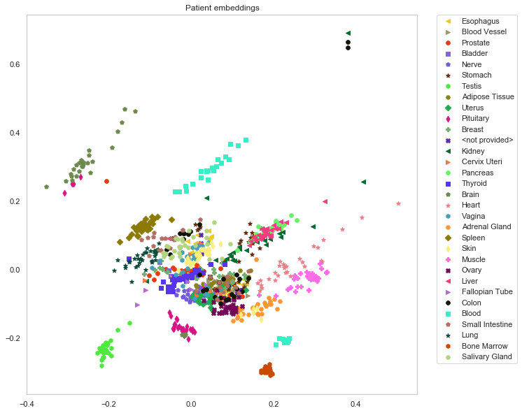

# Factorized embeddings learns rich and biologically meaningful embedding spaces using factorized tensor decomposition
### Motivation: 
The recent development of sequencing technologies revolutionised our understanding of the inner workings of the cell as well as the way disease is treated. A single RNA sequencing (RNA-Seq) experiment, however, measures tens of thousands of parameters simultaneously. While the results are information rich, data analysis provides a challenge. Dimensionality reduction methods help with this task by extracting patterns from the data by compressing it into compact vector representations.

### Results: 
We present the factorized embeddings (FE) model, a self-supervised deep learning algorithm that learns simultaneously, by tensor factorization, gene and sample representation spaces. We ran the model on RNA-Seq data from two large-scale cohorts and observed that the sample representation captures information on single-gene and global gene expression patterns. Moreover, we found that the gene representation space was organized such that tissue-specific genes, highly correlated genes as well as genes participating in the same GO terms were grouped. Finally, we compared the vector representation of samples learned by the FE model to other similar models on 49 regression tasks. We report that the FE-trained representations rank first or second in all of the tasks, surpassing, sometimes by a considerable margin, other representations.

### Content:
A toy model is provided for tinkering with the model and the plots.
The FE model depends on:
+ pytorch
+ numpy
+ pandas

### Usage:

For the most basic run do the following:
```python
python main.py --data-dir DATA_FOLDER --data-file DATA.csv
```
The data file should be a `.npy` file where samples are rows and features are columns. (ex: patient x gene)

### Citation:

Factorized embeddings learns rich and biologically meaningful embedding spaces using factorized tensor decomposition
Assya Trofimov, Joseph Paul Cohen, Yoshua Bengio, Claude Perreault, and Sébastien Lemieux
Bioinformatics. 2020 Jul; 36(Suppl 1): i417–i426.
[Download paper](https://www.ncbi.nlm.nih.gov/pmc/articles/PMC7355243/)


Workshop manuscript from 2017:
Uncovering the Gene Usage of Human Tissue Cells with Joint Factorized Embeddings. 
Assya Trofimov, Joseph Paul Cohen, Claude Perreault, Yoshua Bengio, Sebastien Lemieux.
International Conference on Machine Learning (ICML) Workshop on Computational Biology (WCB), 2017.
[Download 2017 workshop paper](WCB_2017_paper_30.pdf)


### News
Manuscript accepted for publication and oral presentation at ISMB 2020 on 2020-03-14
Manuscript submitted 2020-01-30



